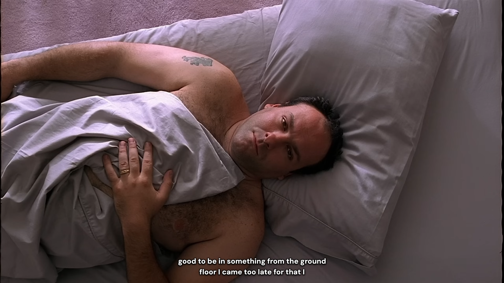

# YouTube Caption Styler

A Tampermonkey userscript that styles YouTube captions to look like Netflix.

## Features
- DM Sans Bold font (closest free match to Netflix Sans)
- Centered captions with no background box
- Thick text shadow outline for readability on any background
- Aggressive MutationObserver to prevent left drift

## Installation
1. Install [Tampermonkey](https://www.tampermonkey.net/) on your browser
2. Click [here](https://raw.githubusercontent.com/2may2011/yt-caption-styler/main/yt-caption-styler.user.js) to install the script
3. Turn on captions on any YouTube video (`C` key)

## Preview
